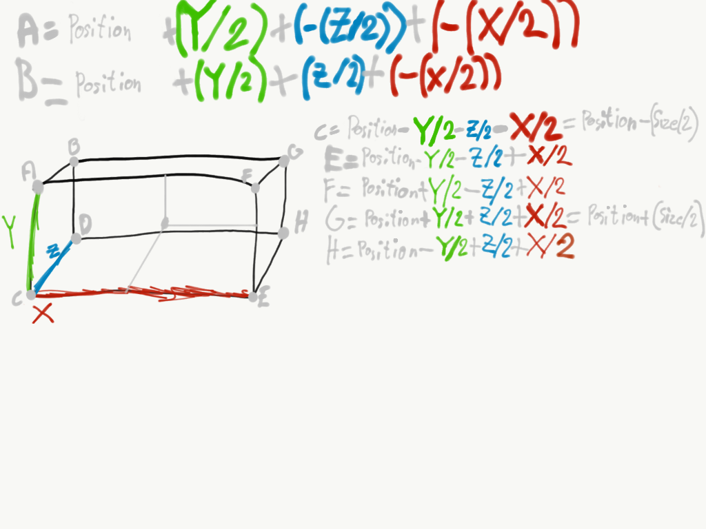

# Get the Corners of a BasePart

## Table of Contents

* [Get the Corners of a normal Part](#get-the-corners-of-a-normal-part)
* [Edit 1:](#edit-1:)

## Get the Corners of a normal Part
In this tutorial I will deal with getting the corners of a part. These can be used for many other things, for example to control a part into a certain region without using the function game.Workspace:FindPartInRegion3(). Let's start now. In this tutorial each corner is represented by a part which is 1x1x1. So you can see if the corner is really there where it should be. To get the corners of a non-rotating part you need a formula. For this it is better to paint a sketch. Here is what I painted (I'm not an artist so please no criticism):



In this sketch you can see how you can get all the corners of a normal part. The technique is to use vectors, just being able to read a bit, turn everything into vectors and there you have it!

The result is this:


```Lua
local Parent = script.Parent
local Position = Parent.CFrame
local Size = Parent.Size

local PartA = Instance.new("Part", workspace)
local PartB = Instance.new("Part", workspace)
local PartC = Instance.new("Part", workspace)
local PartD = Instance.new("Part", workspace)
local PartE = Instance.new("Part", workspace)
local PartF = Instance.new("Part", workspace)
local PartG = Instance.new("Part", workspace)
local PartH = Instance.new("Part", workspace)


PartA.Name = "A"
PartB.Name = "B"
PartC.Name = "C"
PartD.Name = "D"
PartE.Name = "E"
PartF.Name = "F"
PartG.Name = "G"
PartH.Name = "H"


PartA.CanCollide = false
PartB.CanCollide = false
PartC.CanCollide = false
PartD.CanCollide = false
PartE.CanCollide = false
PartF.CanCollide = false
PartG.CanCollide = false
PartH.CanCollide = false


PartA.Anchored = true
PartB.Anchored = true
PartC.Anchored = true
PartD.Anchored = true
PartE.Anchored = true
PartF.Anchored = true
PartG.Anchored = true
PartH.Anchored = true


PartA.Size = Vector3.new(1,1,1)
PartB.Size = Vector3.new(1,1,1)
PartC.Size = Vector3.new(1,1,1)
PartD.Size = Vector3.new(1,1,1)
PartE.Size = Vector3.new(1,1,1)
PartF.Size = Vector3.new(1,1,1)
PartG.Size = Vector3.new(1,1,1)
PartH.Size = Vector3.new(1,1,1)


PartA.CFrame = CFrame.new(Position.Position + Vector3.new(-Size.X/2, Size.Y/2, -Size.Z/2))
PartB.CFrame = CFrame.new(Position.Position + Vector3.new(-Size.X/2, Size.Y/2, Size.Z/2))
PartC.CFrame = CFrame.new(Position.Position - Size/2)
PartD.CFrame = CFrame.new(Position.Position + Vector3.new(Size.X/2 , -Size.Y/2 , Size.Z/2))
PartE.CFrame = CFrame.new(Position.Position + Vector3.new(Size.X/2 , -Size.Y/2 , -Size.Z/2))
PartF.CFrame = CFrame.new(Position.Position + Vector3.new(Size.X/2 , Size.Y/2 , -Size.Z/2))
PartG.CFrame = CFrame.new(Position.Position + Size/2)
PartH.CFrame = CFrame.new(Position.Position + Vector3.new(-Size.X/2 , -Size.Y/2 , Size.Z/2))
```

Yes, it works, but it still remains a problem:


As you can see, if our part turns, our corners don't position themselves where they should and this can lead to unwanted results. This part was the hardest, but could be solved with the help of [Elcore](https://devforum.roblox.com/u/elocore/summary) (I asked [here](https://devforum.roblox.com/t/cframe-toobjectspace-does-not-really-work/443293) for help). To solve this problem you need to use CFrames to transform the CFrame of the corners of the part in the object space, as it says in the [wiki](https://developer.roblox.com/en-us/api-reference/datatype/CFrame) we just have to multiply the two CFrames and the final result:


```Lua
--The two scripts must be in the part from which you want to get the corners.
--First Script
local Position = script.Parent.CFrame
local Size = script.Parent.Size
local RunService = game:GetService("RunService")
local Event = script.Parent.Event

local PartA = Instance.new("Part", workspace)
local PartB = Instance.new("Part", workspace)
local PartC = Instance.new("Part", workspace)
local PartD = Instance.new("Part", workspace)
local PartE = Instance.new("Part", workspace)
local PartF = Instance.new("Part", workspace)
local PartG = Instance.new("Part", workspace)
local PartH = Instance.new("Part", workspace)


PartA.Name = "A"
PartB.Name = "B"
PartC.Name = "C"
PartD.Name = "D"
PartE.Name = "E"
PartF.Name = "F"
PartG.Name = "G"
PartH.Name = "H"


PartA.CanCollide = false
PartB.CanCollide = false
PartC.CanCollide = false
PartD.CanCollide = false
PartE.CanCollide = false
PartF.CanCollide = false
PartG.CanCollide = false
PartH.CanCollide = false


PartA.Anchored = true
PartB.Anchored = true
PartC.Anchored = true
PartD.Anchored = true
PartE.Anchored = true
PartF.Anchored = true
PartG.Anchored = true
PartH.Anchored = true


PartA.Size = Vector3.new(1,1,1)
PartB.Size = Vector3.new(1,1,1)
PartC.Size = Vector3.new(1,1,1)
PartD.Size = Vector3.new(1,1,1)
PartE.Size = Vector3.new(1,1,1)
PartF.Size = Vector3.new(1,1,1)
PartG.Size = Vector3.new(1,1,1)
PartH.Size = Vector3.new(1,1,1)

RunService.Heartbeat:Connect(function()
	Event:Fire(PartA,PartB,PartC,PartD,PartE,PartF,PartG,PartH,script.Parent.CFrame,script.Parent.Size)
end)

--Second Script
local Event = script.Parent.Event

Event.Event:Connect(function(PartA,PartB,PartC,PartD,PartE,PartF,PartG,PartH,Position,Size)
	PartA.CFrame = Position*CFrame.new(-Size.X/2, Size.Y/2, -Size.Z/2)
	PartB.CFrame = Position*CFrame.new(-Size.X/2, Size.Y/2, Size.Z/2)
	PartC.CFrame = Position*CFrame.new(-Size/2)
	PartD.CFrame = Position*CFrame.new(Size.X/2 , -Size.Y/2 , Size.Z/2)
	PartE.CFrame = Position*CFrame.new(Size.X/2 , -Size.Y/2 , -Size.Z/2)
	PartF.CFrame = Position*CFrame.new(Size.X/2 , Size.Y/2 , -Size.Z/2)
	PartG.CFrame = Position*CFrame.new(Size/2)
	PartH.CFrame = Position*CFrame.new(-Size.X/2 , -Size.Y/2 , Size.Z/2)	
end)
```

## Edit 1:
This script can of course be written shorter:
```Lua
--The two scripts must be in the part from which you want to get the corners.
--First Script
local Position = script.Parent.CFrame
local Size = script.Parent.Size
local RunService = game:GetService("RunService")
local Event = script.Parent.Event

local Corners = {
	local PartA = Instance.new("Part", workspace)
	local PartB = Instance.new("Part", workspace)
	local PartC = Instance.new("Part", workspace)
	local PartD = Instance.new("Part", workspace)
	local PartE = Instance.new("Part", workspace)
	local PartF = Instance.new("Part", workspace)
	local PartG = Instance.new("Part", workspace)
	local PartH = Instance.new("Part", workspace)
}

Corners.PartA.Name = "A"
Corners.PartB.Name = "B"
Corners.PartC.Name = "C"
Corners.PartD.Name = "D"
Corners.PartE.Name = "E"
Corners.PartF.Name = "F"
Corners.PartG.Name = "G"
Corners.PartH.Name = "H"

for i,v in pairs(Corners) do
	v.CanCollide = false

	v.Anchored = true

	v.Size = Vector3.new(1,1,1)
end

RunService.Heartbeat:Connect(function()
	local Parent = script.Parent
	local Position = Parent.CFrame
	local Size = Parent.Size
	Event:Fire(Corners.PartA, Corners.PartB, Corners.PartC, Corners.PartD, Corners.PartE, Corners.PartF, Corners.PartG, Corners.PartH, Position, Size)
end)

--Second Script
local Event = script.Parent.Event

Event.Event:Connect(function(PartA,PartB,PartC,PartD,PartE,PartF,PartG,PartH,Position,Size)
	PartA.CFrame = Position*CFrame.new(-Size.X/2, Size.Y/2, -Size.Z/2)
	PartB.CFrame = Position*CFrame.new(-Size.X/2, Size.Y/2, Size.Z/2)
	PartC.CFrame = Position*CFrame.new(-Size/2)
	PartD.CFrame = Position*CFrame.new(Size.X/2 , -Size.Y/2 , Size.Z/2)
	PartE.CFrame = Position*CFrame.new(Size.X/2 , -Size.Y/2 , -Size.Z/2)
	PartF.CFrame = Position*CFrame.new(Size.X/2 , Size.Y/2 , -Size.Z/2)
	PartG.CFrame = Position*CFrame.new(Size/2)
	PartH.CFrame = Position*CFrame.new(-Size.X/2 , -Size.Y/2 , Size.Z/2)	
end)
```
So we have a shorter script and it is more readable.
