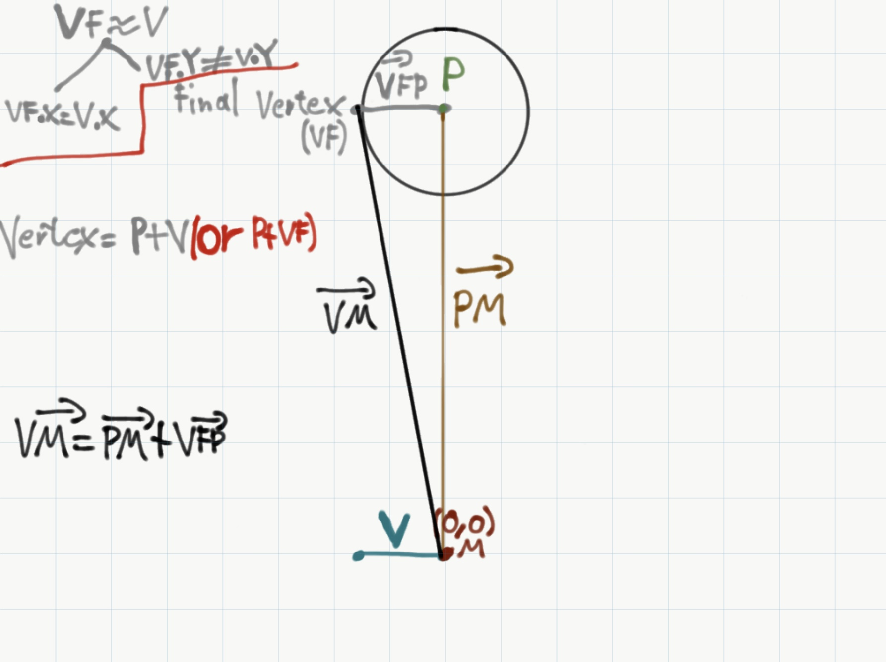
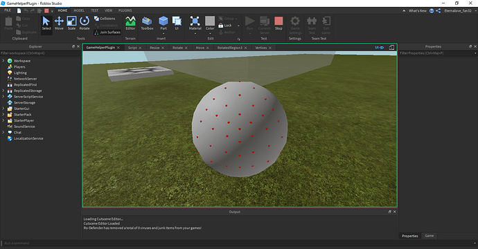
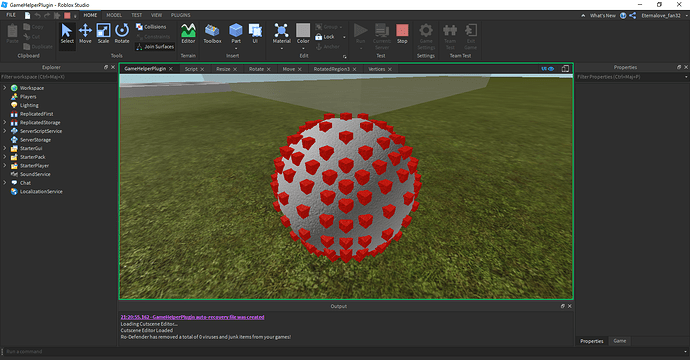
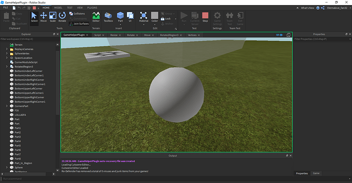
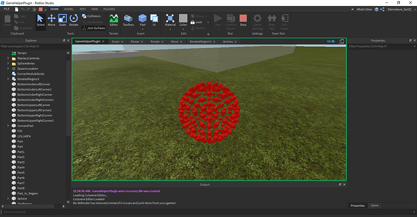
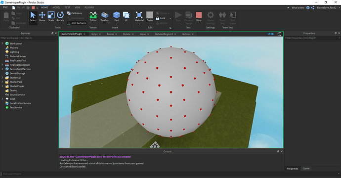

# Get the Corners of a sphere shaped BasePart

## Table of Contents

* [Get the Corners of a sphere shaped Part](#get-the-corners-of-a-sphere-shaped-part)

## Get the Corners of a sphere shaped Part
In this tutorial I will deal with getting the corners of a sphere shaped part. These can be used for many other things, for example to control a part into a certain region without using the function game.Workspace:FindPartInRegion3(). Let's start now. In this tutorial each corner is represented by a part which is 0.01x0.01x0.01. So you can see if the corner is really there where it should be. To get the corners of a non-rotating part you need a formula. For this it is better to paint a sketch. Here is what I painted (I'm not an artist so please no criticism):



In this sketch you can see how you can get all the corners of a sphere. I will use vectors, then only see the Picture and with a bit math we have our Idea!


Okay, but I can't read it. What are all these arrows? And what is this, or this and this? It's okay, though, because I'm here to help you. Like I said, I used vectors and because it's hard to paint in 3D, I painted it in 2D. Before we start to calculate the vertex of the ball we have to know the normal position. For this there is nothing better than a ball with radius 1 and the position at 0,0,0, so the center of the room, then export the whole thing as OBJ file and finally in a program, like Blender. For those of you who wonder why: How else can we get the vertices? Roblox does not currently allow to get the vertices in itself, so we need another program. In Blender, we should cut the ball in four through the vertical, then cut the ball in one through the horizontal. In total we should have 8 pieces. From here on everybody has his own method, but I would personally take the 1/8th that is positive, for those who don't figure out what I mean here is a picture of it:

https://prnt.sc/rg9ong

Then we can switch to edit mode in Blender so you can move, modify, add vertices and most importantly: get their position. In Blender we then switch to this edit mode by pressing the Tab key or finding the GUI of it and just clicking it. Then we should press the N key: to the right of the viewport frame there should be a new GUI. Now comes one of the most boring and exhausting work there is: Getting every single vertex of that 1/8th of an inch. To get a better overview we should delete the other 7/8, be careful to delete only these vertices, not the whole OBJ model. 

When in Blender, move the camera with the middle button of the mouse. Attention: You need a mouse and no laptop integrated mouse. Then there are many other keys, but because Blender has so many key combinations I can't tell you all the basics. With the Z key you can see through the model by selecting wireframe. Then with the B key you can select multiple vertices and with the X key you can delete the selected vertices by selecting vertices.

 If you select a vertex with the left mouse click then the position of the vertex should appear in the GUI that came with the N key: By the way, you have to be careful because Blender uses the real vector system, so while in Roblox you form a vector like this: Vector3.new(x,y,z), the real vector system looks like this: Vector3.new(x,z,y), the z and y are fooled, so for example the height is the Z axis and not the Y axis. Then my plan is to add all received positions to the table. Now the question comes up: Why then use only 1/8 of the whole ball and not get all positions from every single vertex? The reason is simple: A RobloxBall has over 100 vertices, so it would be a real pain to control, copy and vectorize everything one by one. Why this particular 1/8th? You will see later.

Now, we go into studio then we have to make a table (it's recommended by me, otherwise it looks like a catastrophe):

```lua
local Vertices = {
	Vector3.new(0.5, -0.000107, -0.000009),
	Vector3.new(0.474, -0.000107, 0.15811),
	Vector3.new(0.416, -0.000107, 0.27734),
	Vector3.new(0.354, -0.000107, 0.35355),
	Vector3.new(0.474, 0.15799, -0.000009),
	Vector3.new(0.452, 0.15069, 0.15075),
	Vector3.new(0.40099, 0.13349, 0.26726),
	Vector3.new(0.34399, 0.11459, 0.34412),
	Vector3.new(0.416, 0.27729, -0.000009),
	Vector3.new(0.40099, 0.26719, 0.13362),
	Vector3.new(0.364, 0.24239, 0.24253),
	Vector3.new(0.32, 0.21309, 0.3198),
	Vector3.new(0.354, 0.35349, -0.000009),
	Vector3.new(0.34399, 0.34399, 0.1147),
	Vector3.new(0.32, 0.31969, 0.21319),
	Vector3.new(0.28899, 0.28859, 0.28867),
	Vector3.new(0.277, 0.41589, -0.000009),
	Vector3.new(0.267, 0.40079, 0.13362),
	Vector3.new(0.243, 0.36369, 0.24253),
	Vector3.new(0.158, 0.47419, -0.000009),
	Vector3.new(0.15099, 0.45219, 0.15075),
	Vector3.new(0, 0.49989, -0.000009),
	Vector3.new(0.277, -0.000107, 0.41602),
	Vector3.new(0.158, -0.000107, 0.47434),
	Vector3.new(0, -0.000107, 0.49999),
	Vector3.new(0.267, 0.40089, 0.000009),
	Vector3.new(0.15099, 0.15069, 0.45226),
	Vector3.new(0, 0.15799, 0.47434),
	Vector3.new(0.243, 0.24239, 0.3638),
	Vector3.new(0.134, 0.267219, 0.40089),
	Vector3.new(0, 0.27729, 0.41602),
	Vector3.new(0.213, 0.31969, 0.3198),
	Vector3.new(0.115, 0.34399, 0.34412),
	Vector3.new(0, 0.35349, 0.35355),
	Vector3.new(0.134, 0.40079, 0.26726),
	Vector3.new(0, 0.41589, 0.27734),
	Vector3.new(0, 0.47419, 0.15811),
	Vector3.new(0.267, 0.40089, 0.13349),
	Vector3.new(0.267, 0.13349, 0.40089)
}

```

So now we have reached every vertex, but it does not help us in this state. That's where the skis come in: We multiply the position (by which I mean the CFrame) of the ball by the position of each vertex in the table. Now you'll probably say: "But don't tell me that you're really going to multiply each vertex by the position (I still mean the CFrame) of the ball: @Eternalove_fan32, you have really gone crazy now." After this tutorial I might really have become :crazy_face:. Jokes on page, math on. No, I'm so stupid of course, I'll just use loops for that, which will result:

```
--The Vertice Table over this line and insert this script into the target sphere

--The Folder in them we are going stock all the Corners Parts since we use Parts for seeing the invisible corners
local VertexFolder = Instance.new("Folder")
VertexFolder.Parent = workspace
VertexFolder.Name = "SphereVertex"

--The "Position" of the sphere, and with position i mean the CFrame
local Position = script.Parent.CFrame

--The loop
for index, vert in pairs(Vertices) do
        --For each Vertex make a Part with Size 0.01^3, Red Color and as Parent the Folder
	local Vertex = Instance.new("Part")
	Vertex.Parent = VertexFolder
	Vertex.BrickColor = BrickColor.Red()
	Vertex.Size = Vector3.new(0.01, 0.01, 0.01)
	Vertex.CanCollide = false
	Vertex.Anchored = true
	Vertex.Name = "Vertex"..index --The Name: only concat the string Vertex with the index
	Vertex.Position = Position * vert --Get us target Position
end
```

Okay, but Eterna, you said we should take 1/8 of it, and it had to be 1/8 of the positive, but why? And why not other 1/8ths? Ok, you can also work with one of the other 1/8, but the corner (I don't want to repeat the 1/8 all the time) that I recommended is the easy one: If we start the script now, you can see that:

 

Fine, but where are the other vertices? Simple: They are not there because they are not in the table. So, who wants to define more than 200 vertices in this table? Certainly not me. That's why the loops exist: It can do all the hard work for us:

```
--The Vertices Table over this line

for _,vert in pairs(Vertices) do
    local Mirrored = -vert
    local MirroredX = Vector3.new(-vert.X, vert.Y, vert.Z)
    local MirroredY = Vector3.new(vert.X, -vert.Y, vert.Z)
    local MirroredZ = Vector3.new(vert.X, vert.Y, -vert.Z)

    if table.find(Vertices, Mirrored) == "nil" then --If it not find the already mirrored vertex, then insert it in the table
        table.insert(Vertices, #Vertices + 1, Mirrored)

    elseif table.find(Vertices, MirroredX) == "nil" then
        table.insert(Vertices, #Vertices + 1, MirroredX)

    elseif table.find(Vertices, MirroredY) == "nil" then
        table.insert(Vertices, #Vertices + 1, MirroredY)

    elseif table.find(Vertices, MirroredZ) == "nil" then
        table.insert(Vertices, #Vertices + 1, MirroredZ)
    end
end
```

Now we have two problems, the first one comes when you try another size, while the second comes when you try the script from up here, the script takes more than 10 seconds before it shows us the vertices. Ten seconds is quite long and can change everything, especially in fast games as well as action games, fighting games and so on. There is only one way to speed it up: put everything into the table. I used a loop and print system, but if you want to know in detail, just ask down here. The final table is this one:

(WIP)

Now we can deal with the second problem: if we now take the ball with radius 1 then we get this result:

 

But if you try another size:

 

 

The problem is simple: Since we took the vertices of the ball with radius 1, it is calculated with radius 1, although it is not absolutely necessary now. So, how can we solve it? The solution is very simple, just multiply the vertex with the size and then we have also adjusted the vertex to the size:

 

And we're practically finished! You can now use the vertexes of your RobloxBall the way you want.

Final Script:
```lua
local Parent = script.Parent
local Position = Parent.CFrame
local Size = Parent.Size
local Radius = Parent.Size/2
local RunService = game:GetService("RunService")

local Vertices = {
	Vector3.new(0.5, -0.000107, -0.000009),
	Vector3.new(0.474, -0.000107, 0.15811),
	Vector3.new(0.416, -0.000107, 0.27734),
	Vector3.new(0.354, -0.000107, 0.35355),
	Vector3.new(0.474, 0.15799, -0.000009),
	Vector3.new(0.452, 0.15069, 0.15075),
	Vector3.new(0.40099, 0.13349, 0.26726),
	Vector3.new(0.34399, 0.11459, 0.34412),
	Vector3.new(0.416, 0.27729, -0.000009),
	Vector3.new(0.40099, 0.26719, 0.13362),
	Vector3.new(0.364, 0.24239, 0.24253),
	Vector3.new(0.32, 0.21309, 0.3198),
	Vector3.new(0.354, 0.35349, -0.000009),
	Vector3.new(0.34399, 0.34399, 0.1147),
	Vector3.new(0.32, 0.31969, 0.21319),
	Vector3.new(0.28899, 0.28859, 0.28867),
	Vector3.new(0.277, 0.41589, -0.000009),
	Vector3.new(0.267, 0.40079, 0.13362),
	Vector3.new(0.243, 0.36369, 0.24253),
	Vector3.new(0.158, 0.47419, -0.000009),
	Vector3.new(0.15099, 0.45219, 0.15075),
	Vector3.new(0, 0.49989, -0.000009),
	Vector3.new(0.277, -0.000107, 0.41602),
	Vector3.new(0.158, -0.000107, 0.47434),
	Vector3.new(0, -0.000107, 0.49999),
	Vector3.new(0.267, 0.40089, 0.000009),
	Vector3.new(0.15099, 0.15069, 0.45226),
	Vector3.new(0, 0.15799, 0.47434),
	Vector3.new(0.243, 0.24239, 0.3638),
	Vector3.new(0.134, 0.267219, 0.40089),
	Vector3.new(0, 0.27729, 0.41602),
	Vector3.new(0.213, 0.31969, 0.3198),
	Vector3.new(0.115, 0.34399, 0.34412),
	Vector3.new(0, 0.35349, 0.35355),
	Vector3.new(0.134, 0.40079, 0.26726),
	Vector3.new(0, 0.41589, 0.27734),
	Vector3.new(0, 0.47419, 0.15811),
	Vector3.new(0.267, 0.40089, 0.13349),
	Vector3.new(0.267, 0.13349, 0.40089),
	
	

	Vector3.new(-0.5, 0.000107, 9.00000032e-06),
	Vector3.new(-0.474000007, 0.000107, -0.158109993),
	Vector3.new(-0.416000009, 0.000107, -0.277339995),
	Vector3.new(-0.354000002, 0.000107, -0.353549987),
	Vector3.new(-0.474000007, -0.157989994, 9.00000032e-06),
	Vector3.new(-0.451999992, -0.150690004, -0.150749996),
	Vector3.new(-0.400990009, -0.133489996, -0.267259985),
	Vector3.new(-0.343989998, -0.114589997, -0.344119996),
	Vector3.new(-0.416000009, -0.277289987, 9.00000032e-06),
	Vector3.new(-0.400990009, -0.267190009, -0.133619994),
	Vector3.new(-0.363999993, -0.242390007, -0.242530003),
	Vector3.new(-0.319999993, -0.213090003, -0.319799989),
	Vector3.new(-0.354000002, -0.353489995, 9.00000032e-06),
	Vector3.new(-0.343989998, -0.343989998, -0.114699997),
	Vector3.new(-0.319999993, -0.319689989, -0.213190004),
	Vector3.new(-0.288989991, -0.288590014, -0.288670003),
	Vector3.new(-0.27700001, -0.415890008, 9.00000032e-06),
	Vector3.new(-0.26699999, -0.400790006, -0.133619994),
	Vector3.new(-0.243000001, -0.363689989, -0.242530003),
	Vector3.new(-0.158000007, -0.474189997, 9.00000032e-06),
	Vector3.new(-0.150989994, -0.452190012, -0.150749996),
	Vector3.new(-0, -0.49989, 9.00000032e-06),
	Vector3.new(-0.27700001, 0.000107, -0.416020006),
	Vector3.new(-0.158000007, 0.000107, -0.474339992),
	Vector3.new(-0, 0.000107, -0.499989986),
	Vector3.new(-0.26699999, -0.400889993, -9.00000032e-06),
	Vector3.new(-0.150989994, -0.150690004, -0.452259988),
	Vector3.new(-0, -0.157989994, -0.474339992),
	Vector3.new(-0.243000001, -0.242390007, -0.363799989),
	Vector3.new(-0.134000003, -0.267219007, -0.400889993),
	Vector3.new(-0, -0.277289987, -0.416020006),
	Vector3.new(-0.213, -0.319689989, -0.319799989),
	Vector3.new(-0.115000002, -0.343989998, -0.344119996),
	Vector3.new(-0, -0.353489995, -0.353549987),
	Vector3.new(-0.134000003, -0.400790006, -0.267259985),
	Vector3.new(-0, -0.415890008, -0.277339995),
	Vector3.new(-0, -0.474189997, -0.158109993),
	Vector3.new(-0.26699999, -0.400889993, -0.133489996),
    Vector3.new(-0.26699999, -0.133489996, -0.400889993),


    Vector3.new(-0.5, -0.00010699999984354, -9.0000003183377e-06),
    Vector3.new(-0.47400000691414, -0.00010699999984354, 0.15810999274254),
    Vector3.new(-0.41600000858307, -0.00010699999984354, 0.27733999490738),
    Vector3.new(-0.35400000214577, -0.00010699999984354, 0.35354998707771),
    Vector3.new(-0.47400000691414, 0.15798999369144, -9.0000003183377e-06),
    Vector3.new(-0.45199999213219, 0.15069000422955, 0.15074999630451),
    Vector3.new(-0.40099000930786, 0.13348999619484, 0.26725998520851),
    Vector3.new(-0.34398999810219, 0.11458999663591, 0.34411999583244),
    Vector3.new(-0.41600000858307, 0.27728998661041, -9.0000003183377e-06),
    Vector3.new(-0.40099000930786, 0.26719000935555, 0.13361999392509),
    Vector3.new(-0.36399999260902, 0.24239000678062, 0.24253000319004),
    Vector3.new(-0.31999999284744, 0.21309000253677, 0.3197999894619),
    Vector3.new(-0.35400000214577, 0.35348999500275, -9.0000003183377e-06),
    Vector3.new(-0.34398999810219, 0.34398999810219, 0.11469999700785),
    Vector3.new(-0.31999999284744, 0.31968998908997, 0.21319000422955),
    Vector3.new(-0.28898999094963, 0.28859001398087, 0.28867000341415),
    Vector3.new(-0.27700001001358, 0.41589000821114, -9.0000003183377e-06),
    Vector3.new(-0.266999989748, 0.40079000592232, 0.13361999392509),
    Vector3.new(-0.24300000071526, 0.36368998885155, 0.24253000319004),
    Vector3.new(-0.15800000727177, 0.47418999671936, -9.0000003183377e-06),
    Vector3.new(-0.1509899944067, 0.45219001173973, 0.15074999630451),
    Vector3.new(0, -0.49988999962807, -9.0000003183377e-06),
    Vector3.new(-0.27700001001358, -0.00010699999984354, 0.41602000594139),
    Vector3.new(-0.15800000727177, -0.00010699999984354, 0.47433999180794),
    Vector3.new(0, 0.00010699999984354, 0.49998998641968),
    Vector3.new(-0.266999989748, 0.40088999271393, 9.0000003183377e-06),
    Vector3.new(-0.1509899944067, 0.15069000422955, 0.4522599875927),
    Vector3.new(0, -0.15798999369144, 0.47433999180794),
    Vector3.new(-0.24300000071526, 0.24239000678062, 0.36379998922348),
    Vector3.new(-0.13400000333786, 0.26721900701523, 0.40088999271393),
    Vector3.new(0, -0.27728998661041, 0.41602000594139),
    Vector3.new(-0.21299999952316, 0.31968998908997, 0.3197999894619),
    Vector3.new(-0.11500000208616, 0.34398999810219, 0.34411999583244),
    Vector3.new(0, -0.35348999500275, 0.35354998707771),
    Vector3.new(-0.13400000333786, 0.40079000592232, 0.26725998520851),
    Vector3.new(0, -0.41589000821114, 0.27733999490738),
    Vector3.new(0, -0.47418999671936, 0.15810999274254),
    Vector3.new(-0.266999989748, 0.40088999271393, 0.13348999619484),
    Vector3.new(-0.266999989748, 0.13348999619484, 0.40088999271393),
    Vector3.new(0.5, 0.00010699999984354, 9.0000003183377e-06),
    Vector3.new(0.47400000691414, 0.00010699999984354, -0.15810999274254),
    Vector3.new(0.41600000858307, 0.00010699999984354, -0.27733999490738),
    Vector3.new(0.35400000214577, 0.00010699999984354, -0.35354998707771),
    Vector3.new(0.47400000691414, -0.15798999369144, 9.0000003183377e-06),
    Vector3.new(0.45199999213219, -0.15069000422955, -0.15074999630451),
    Vector3.new(0.40099000930786, -0.13348999619484, -0.26725998520851),
    Vector3.new(0.34398999810219, -0.11458999663591, -0.34411999583244),
    Vector3.new(0.41600000858307, -0.27728998661041, 9.0000003183377e-06),
    Vector3.new(0.40099000930786, -0.26719000935555, -0.13361999392509),
    Vector3.new(0.36399999260902, -0.24239000678062, -0.24253000319004),
    Vector3.new(0.31999999284744, -0.21309000253677, -0.3197999894619),
    Vector3.new(0.35400000214577, -0.35348999500275, 9.0000003183377e-06),
    Vector3.new(0.34398999810219, -0.34398999810219, -0.11469999700785),
    Vector3.new(0.31999999284744, -0.31968998908997, -0.21319000422955),
    Vector3.new(0.28898999094963, -0.28859001398087, -0.28867000341415),
    Vector3.new(0.27700001001358, -0.41589000821114, 9.0000003183377e-06),
    Vector3.new(0.266999989748, -0.40079000592232, -0.13361999392509),
    Vector3.new(0.24300000071526, -0.36368998885155, -0.24253000319004),
    Vector3.new(0.15800000727177, -0.47418999671936, 9.0000003183377e-06),
    Vector3.new(0.1509899944067, -0.45219001173973, -0.15074999630451),
    Vector3.new(0, 0.49988999962807, 9.0000003183377e-06),
    Vector3.new(0.27700001001358, 0.00010699999984354, -0.41602000594139),
    Vector3.new(0.15800000727177, 0.00010699999984354, -0.47433999180794),
    Vector3.new(0, -0.00010699999984354, -0.49998998641968),
    Vector3.new(0.266999989748, -0.40088999271393, -9.0000003183377e-06),
    Vector3.new(0.1509899944067, -0.15069000422955, -0.4522599875927),
    Vector3.new(0, 0.15798999369144, -0.47433999180794),
    Vector3.new(0.24300000071526, -0.24239000678062, -0.36379998922348),
    Vector3.new(0.13400000333786, -0.26721900701523, -0.40088999271393),
    Vector3.new(0, 0.27728998661041, -0.41602000594139),
    Vector3.new(0.21299999952316, -0.31968998908997, -0.3197999894619),
    Vector3.new(0.11500000208616, -0.34398999810219, -0.34411999583244),
    Vector3.new(0, 0.35348999500275, -0.35354998707771),
    Vector3.new(0.13400000333786, -0.40079000592232, -0.26725998520851),
    Vector3.new(0, 0.41589000821114, -0.27733999490738),
    Vector3.new(0, 0.47418999671936, -0.15810999274254),
    Vector3.new(0.266999989748, -0.40088999271393, -0.13348999619484),
    Vector3.new(0.266999989748, -0.13348999619484, -0.40088999271393),


    Vector3.new(0.5, 0.00010699999984354, -9.0000003183377e-06),
    Vector3.new(0.47400000691414, 0.00010699999984354, 0.15810999274254),
    Vector3.new(0.41600000858307, 0.00010699999984354, 0.27733999490738),
    Vector3.new(0.35400000214577, 0.00010699999984354, 0.35354998707771),
    Vector3.new(0.47400000691414, -0.15798999369144, -9.0000003183377e-06),
    Vector3.new(0.45199999213219, -0.15069000422955, 0.15074999630451),
    Vector3.new(0.40099000930786, -0.13348999619484, 0.26725998520851),
    Vector3.new(0.34398999810219, -0.11458999663591, 0.34411999583244),
    Vector3.new(0.41600000858307, -0.27728998661041, -9.0000003183377e-06),
    Vector3.new(0.40099000930786, -0.26719000935555, 0.13361999392509),
    Vector3.new(0.36399999260902, -0.24239000678062, 0.24253000319004),
    Vector3.new(0.31999999284744, -0.21309000253677, 0.3197999894619),
    Vector3.new(0.35400000214577, -0.35348999500275, -9.0000003183377e-06),
    Vector3.new(0.34398999810219, -0.34398999810219, 0.11469999700785),
    Vector3.new(0.31999999284744, -0.31968998908997, 0.21319000422955),
    Vector3.new(0.28898999094963, -0.28859001398087, 0.28867000341415),
    Vector3.new(0.27700001001358, -0.41589000821114, -9.0000003183377e-06),
    Vector3.new(0.266999989748, -0.40079000592232, 0.13361999392509),
    Vector3.new(0.24300000071526, -0.36368998885155, 0.24253000319004),
    Vector3.new(0.15800000727177, -0.47418999671936, -9.0000003183377e-06),
    Vector3.new(0.1509899944067, -0.45219001173973, 0.15074999630451),
    Vector3.new(0.27700001001358, 0.00010699999984354, 0.41602000594139),
    Vector3.new(0.15800000727177, 0.00010699999984354, 0.47433999180794),
    Vector3.new(0.266999989748, -0.40088999271393, 9.0000003183377e-06),
    Vector3.new(0.1509899944067, -0.15069000422955, 0.4522599875927),
    Vector3.new(0.24300000071526, -0.24239000678062, 0.36379998922348),
    Vector3.new(0.13400000333786, -0.26721900701523, 0.40088999271393),
    Vector3.new(0.21299999952316, -0.31968998908997, 0.3197999894619),
    Vector3.new(0.11500000208616, -0.34398999810219, 0.34411999583244),
    Vector3.new(0.13400000333786, -0.40079000592232, 0.26725998520851),
    Vector3.new(0.266999989748, -0.40088999271393, 0.13348999619484),
    Vector3.new(0.266999989748, -0.13348999619484, 0.40088999271393),
    Vector3.new(-0.5, -0.00010699999984354, 9.0000003183377e-06),
    Vector3.new(-0.47400000691414, -0.00010699999984354, -0.15810999274254),
    Vector3.new(-0.41600000858307, -0.00010699999984354, -0.27733999490738),
    Vector3.new(-0.35400000214577, -0.00010699999984354, -0.35354998707771),
    Vector3.new(-0.47400000691414, 0.15798999369144, 9.0000003183377e-06),
    Vector3.new(-0.45199999213219, 0.15069000422955, -0.15074999630451),
    Vector3.new(-0.40099000930786, 0.13348999619484, -0.26725998520851),
    Vector3.new(-0.34398999810219, 0.11458999663591, -0.34411999583244),
    Vector3.new(-0.41600000858307, 0.27728998661041, 9.0000003183377e-06),
    Vector3.new(-0.40099000930786, 0.26719000935555, -0.13361999392509),
    Vector3.new(-0.36399999260902, 0.24239000678062, -0.24253000319004),
    Vector3.new(-0.31999999284744, 0.21309000253677, -0.3197999894619),
    Vector3.new(-0.35400000214577, 0.35348999500275, 9.0000003183377e-06),
    Vector3.new(-0.34398999810219, 0.34398999810219, -0.11469999700785),
    Vector3.new(-0.31999999284744, 0.31968998908997, -0.21319000422955),
    Vector3.new(-0.28898999094963, 0.28859001398087, -0.28867000341415),
    Vector3.new(-0.27700001001358, 0.41589000821114, 9.0000003183377e-06),
    Vector3.new(-0.266999989748, 0.40079000592232, -0.13361999392509),
    Vector3.new(-0.24300000071526, 0.36368998885155, -0.24253000319004),
    Vector3.new(-0.15800000727177, 0.47418999671936, 9.0000003183377e-06),
    Vector3.new(-0.1509899944067, 0.45219001173973, -0.15074999630451),
    Vector3.new(-0.27700001001358, -0.00010699999984354, -0.41602000594139),
    Vector3.new(-0.15800000727177, -0.00010699999984354, -0.47433999180794),
    Vector3.new(-0.266999989748, 0.40088999271393, -9.0000003183377e-06),
    Vector3.new(-0.1509899944067, 0.15069000422955, -0.4522599875927),
    Vector3.new(-0.24300000071526, 0.24239000678062, -0.36379998922348),
    Vector3.new(-0.13400000333786, 0.26721900701523, -0.40088999271393),
    Vector3.new(-0.21299999952316, 0.31968998908997, -0.3197999894619),
    Vector3.new(-0.11500000208616, 0.34398999810219, -0.34411999583244),
    Vector3.new(-0.13400000333786, 0.40079000592232, -0.26725998520851),
    Vector3.new(-0.266999989748, 0.40088999271393, -0.13348999619484),
    Vector3.new(-0.266999989748, 0.13348999619484, -0.40088999271393),
    Vector3.new(-0.5, 0.00010699999984354, -9.0000003183377e-06),
    Vector3.new(-0.47400000691414, 0.00010699999984354, 0.15810999274254),
    Vector3.new(-0.41600000858307, 0.00010699999984354, 0.27733999490738),
    Vector3.new(-0.35400000214577, 0.00010699999984354, 0.35354998707771),
    Vector3.new(-0.47400000691414, -0.15798999369144, -9.0000003183377e-06),
    Vector3.new(-0.45199999213219, -0.15069000422955, 0.15074999630451),
    Vector3.new(-0.40099000930786, -0.13348999619484, 0.26725998520851),
    Vector3.new(-0.34398999810219, -0.11458999663591, 0.34411999583244),
    Vector3.new(-0.41600000858307, -0.27728998661041, -9.0000003183377e-06),
    Vector3.new(-0.40099000930786, -0.26719000935555, 0.13361999392509),
    Vector3.new(-0.36399999260902, -0.24239000678062, 0.24253000319004),
    Vector3.new(-0.31999999284744, -0.21309000253677, 0.3197999894619),
    Vector3.new(-0.35400000214577, -0.35348999500275, -9.0000003183377e-06),
    Vector3.new(-0.34398999810219, -0.34398999810219, 0.11469999700785),
    Vector3.new(-0.31999999284744, -0.31968998908997, 0.21319000422955),
    Vector3.new(-0.28898999094963, -0.28859001398087, 0.28867000341415),
    Vector3.new(-0.27700001001358, -0.41589000821114, -9.0000003183377e-06),
    Vector3.new(-0.266999989748, -0.40079000592232, 0.13361999392509),
    Vector3.new(-0.24300000071526, -0.36368998885155, 0.24253000319004),
    Vector3.new(-0.15800000727177, -0.47418999671936, -9.0000003183377e-06),
    Vector3.new(-0.1509899944067, -0.45219001173973, 0.15074999630451),
    Vector3.new(-0.27700001001358, 0.00010699999984354, 0.41602000594139),
    Vector3.new(-0.15800000727177, 0.00010699999984354, 0.47433999180794),
    Vector3.new(-0.266999989748, -0.40088999271393, 9.0000003183377e-06),
    Vector3.new(-0.1509899944067, -0.15069000422955, 0.4522599875927),
    Vector3.new(-0.24300000071526, -0.24239000678062, 0.36379998922348),
    Vector3.new(-0.13400000333786, -0.26721900701523, 0.40088999271393),
    Vector3.new(-0.21299999952316, -0.31968998908997, 0.3197999894619),
    Vector3.new(-0.11500000208616, -0.34398999810219, 0.34411999583244),
    Vector3.new(-0.13400000333786, -0.40079000592232, 0.26725998520851),
    Vector3.new(-0.266999989748, -0.40088999271393, 0.13348999619484),
    Vector3.new(-0.266999989748, -0.13348999619484, 0.40088999271393),
    Vector3.new(0.5, -0.00010699999984354, 9.0000003183377e-06),
    Vector3.new(0.47400000691414, -0.00010699999984354, -0.15810999274254),
    Vector3.new(0.41600000858307, -0.00010699999984354, -0.27733999490738),
    Vector3.new(0.35400000214577, -0.00010699999984354, -0.35354998707771),
    Vector3.new(0.47400000691414, 0.15798999369144, 9.0000003183377e-06),
    Vector3.new(0.45199999213219, 0.15069000422955, -0.15074999630451),
    Vector3.new(0.40099000930786, 0.13348999619484, -0.26725998520851),
    Vector3.new(0.34398999810219, 0.11458999663591, -0.34411999583244),
    Vector3.new(0.41600000858307, 0.27728998661041, 9.0000003183377e-06),
    Vector3.new(0.40099000930786, 0.26719000935555, -0.13361999392509),
    Vector3.new(0.36399999260902, 0.24239000678062, -0.24253000319004),
    Vector3.new(0.31999999284744, 0.21309000253677, -0.3197999894619),
    Vector3.new(0.35400000214577, 0.35348999500275, 9.0000003183377e-06),
    Vector3.new(0.34398999810219, 0.34398999810219, -0.11469999700785),
    Vector3.new(0.31999999284744, 0.31968998908997, -0.21319000422955),
    Vector3.new(0.28898999094963, 0.28859001398087, -0.28867000341415),
    Vector3.new(0.27700001001358, 0.41589000821114, 9.0000003183377e-06),
    Vector3.new(0.266999989748, 0.40079000592232, -0.13361999392509),
    Vector3.new(0.24300000071526, 0.36368998885155, -0.24253000319004),
    Vector3.new(0.15800000727177, 0.47418999671936, 9.0000003183377e-06),
    Vector3.new(0.1509899944067, 0.45219001173973, -0.15074999630451),
    Vector3.new(0.27700001001358, -0.00010699999984354, -0.41602000594139),
    Vector3.new(0.15800000727177, -0.00010699999984354, -0.47433999180794),
    Vector3.new(0.266999989748, 0.40088999271393, -9.0000003183377e-06),
    Vector3.new(0.1509899944067, 0.15069000422955, -0.4522599875927),
    Vector3.new(0.24300000071526, 0.24239000678062, -0.36379998922348),
    Vector3.new(0.13400000333786, 0.26721900701523, -0.40088999271393),
    Vector3.new(0.21299999952316, 0.31968998908997, -0.3197999894619),
    Vector3.new(0.11500000208616, 0.34398999810219, -0.34411999583244),
    Vector3.new(0.13400000333786, 0.40079000592232, -0.26725998520851),
    Vector3.new(0.266999989748, 0.40088999271393, -0.13348999619484),
    Vector3.new(0.266999989748, 0.13348999619484, -0.40088999271393),
}

for index, vert in pairs(Vertices) do
	local Vertex = Instance.new("Part", workspace.Vertex)
	Vertex.BrickColor = BrickColor.Red()
	Vertex.Size = Vector3.new(0.01, 0.01, 0.01)
	Vertex.CanCollide = false
	Vertex.Anchored = true
	Vertex.Name = "Vertex"..index
	Vertex.Position = Position * (vert * Size)
end
```

## New Update
Ok, with a bit math and tests i figured out, to write a code with them you can not only get the position of all vertices, but also update the positions (if you move the part 1 stud to left, then all vertices are also moved. I just get the offset between the old and new position to update the vertices. This **NOT** supports rotation):